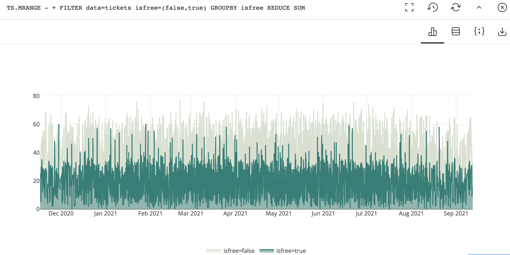

# Zewtopia Ticket Sales!
### <em>You will need access to a Redis-TimeSeries Database to work with the following data:</em>

## If using RedisInsight - you can choose the 'Workbench' interface and execute several commands with one Button-click


## Execute the following commands being sure to include your prefix as part of the key-names when sharing a database
### (so you would replace ot11 with your initials and birth-month at the front of the key-names for the time-series keys created below)

## The following commands will:
* Create several new keys establishing labels so that they can later be analyzed and filtered and grouped:
* populate the keys with values for roughly 1 year of ticket sales:

``` 
TS.CREATE ot11:zew:adult:{tickets} retention 0 LABELS data tickets attraction entrance isfree false audience adult
TS.CREATE ot11:zew:child:{tickets} retention 0 LABELS data tickets attraction entrance isfree false audience child
TS.CREATE ot11:zew:pettingzoo:{tickets} retention 0 LABELS data tickets attraction pettingzoo isfree false audience all
TS.CREATE ot11:zew:bonobolecture:{tickets} retention 0 LABELS data tickets attraction bonobolecture isfree false audience adult
TS.CREATE ot11:zew:gorillafeeding:{tickets} retention 0 LABELS data tickets attraction gorillafeeding isfree true audience all
TS.CREATE ot11:zew:3dmovie:{tickets} retention 0 LABELS data tickets attraction 3dmovie isfree false audience all
TS.CREATE ot11:zew:snakefeeding:{tickets} retention 0 LABELS data tickets attraction snakefeeding isfree true audience all
```
## For each of the following LUA script executions provide the key-name with your prefix as the 1st key-name argument
```
EVAL "for season = 1605525600000,1625613600000,2600000000 do for index = 1,365 do local vall = math.random(0,12) redis.call('TS.ADD', KEYS[1], ((index*21200000)+season), (vall+(index%9)) ) end end" 1 ot11:zew:adult:{tickets}
EVAL "for season = 1605525600000,1625613600000,2600000000 do for index = 1,365 do local vall = math.random(0,22) redis.call('TS.ADD', KEYS[1], ((index*21200000)+season), (vall+(index%19)) ) end end" 1 ot11:zew:child:{tickets}
EVAL "for season = 1605525600000,1625613600000,2600000000 do for index = 1,365 do local vall = math.random(0,9) redis.call('TS.ADD', KEYS[1], ((index*21200000)+season), (vall+(index%4)) ) end end" 1 ot11:zew:pettingzoo:{tickets}
EVAL "for season = 1605525600000,1625613600000,2600000000 do for index = 1,365 do local vall = math.random(0,2) redis.call('TS.ADD', KEYS[1], ((index*21200000)+season), (vall*(index%2)) ) end end" 1 ot11:zew:bonobolecture:{tickets}
EVAL "for season = 1605525600000,1625613600000,2600000000 do for index = 1,365 do local vall = math.random(0,4) redis.call('TS.ADD', KEYS[1], ((index*21200000)+season), (vall*(index%2)) ) end end" 1 ot11:zew:3dmovie:{tickets}
EVAL "for season = 1605525600000,1625613600000,2600000000 do for index = 1,365 do local vall = math.random(0,30) redis.call('TS.ADD', KEYS[1], ((index*21200000)+season), (vall+(index%7)) ) end end" 1 ot11:zew:gorillafeeding:{tickets}
EVAL "for season = 1605525600000,1625613600000,2600000000 do for index = 1,60 do local vall = math.random(0,30) redis.call('TS.ADD', KEYS[1], ((index*(21200000*6))+season), (vall*(index%2)) ) end end" 1 ot11:zew:snakefeeding:{tickets}
```

* now, using RedisInsight, begin your analysis using Time-Series Queries:

``` 
TS.MRANGE - + FILTER data=tickets isfree=(false,true) GROUPBY isfree REDUCE SUM
```


* can you tell whether tickets that are free are more popular than tickets that are not free?
### What about a different query showing the Daily story:
```                
TS.MRANGE - + AGGREGATION SUM 86400000 FILTER data=tickets attraction!=(entrance) GROUPBY isfree REDUCE SUM
```
### Or the Weekly story showing free vs non-free events that are not the entrance fee:
```
TS.MRANGE - + AGGREGATION SUM 604800000 FILTER data=tickets attraction!=(entrance) GROUPBY isfree REDUCE SUM
```
### Weekly story with a different resolution (showing individual attractions):
```
TS.MRANGE - + AGGREGATION SUM 604800000 FILTER data=tickets attraction!=(entrance) GROUPBY attraction REDUCE SUM
```
### Monthly story showing free vs non-free events that are not the entrance fee:
```
TS.MRANGE - + AGGREGATION SUM 2628288000 FILTER data=tickets attraction!=(entrance) GROUPBY isfree REDUCE SUM
```

* How would you query the time-series to uncover which of the attractions sells the most tickets near the beginning of each month? And what about near the end of each month?

[link_to_documentation_for_redis_time_series](https://redis.io/commands/?group=timeseries)

#This completes this look at Time-Series data
(You can stop reading this now)
***

<p/>
#### An Alternate path to command execution would be to execute the shell script below (after editing it of course)
#### It does the same things as the separated commands above and will populate several time-series keys that track ticket sales over about 1 year for various attractions at the zoo
#### The script below does the following:
* Cleanup any old keys:
* Create several new keys establishing labels so that they can later be analyzed and filtered and grouped:
* populate the keys with values for roughly 1 year of ticket sales:

NB: Copy paste the following to a file on your machine and edit the host and port values. If you are using a password, you will have to add the redis-ci -a argument for authorization (to allow you to specify a password when connecting)
* Once you have saved the file with the proper settings like host and port - execute the script 

``` 
#!/bin/sh
host=127.0.0.1
port=6379
redis-cli -h $host -p $port del zew:adult:{tickets}
redis-cli -h $host -p $port del zew:child:{tickets}
redis-cli -h $host -p $port del zew:pettingzoo:{tickets}
redis-cli -h $host -p $port del zew:bonobolecture:{tickets}
redis-cli -h $host -p $port del zew:gorillafeeding:{tickets}
redis-cli -h $host -p $port del zew:3dmovie:{tickets}
redis-cli -h $host -p $port del zew:snakefeeding:{tickets}

redis-cli -h $host -p $port TS.CREATE zew:adult:{tickets} retention 0 LABELS data tickets attraction entrance isfree false audience adult
redis-cli -h $host -p $port TS.CREATE zew:child:{tickets} retention 0 LABELS data tickets attraction entrance isfree false audience child
redis-cli -h $host -p $port TS.CREATE zew:pettingzoo:{tickets} retention 0 LABELS data tickets attraction pettingzoo isfree false audience all
redis-cli -h $host -p $port TS.CREATE zew:bonobolecture:{tickets} retention 0 LABELS data tickets attraction bonobolecture isfree false audience adult
redis-cli -h $host -p $port TS.CREATE zew:gorillafeeding:{tickets} retention 0 LABELS data tickets attraction gorillafeeding isfree true audience all
redis-cli -h $host -p $port TS.CREATE zew:3dmovie:{tickets} retention 0 LABELS data tickets attraction 3dmovie isfree false audience all
redis-cli -h $host -p $port TS.CREATE zew:snakefeeding:{tickets} retention 0 LABELS data tickets attraction snakefeeding isfree true audience all

redis-cli -h $host -p $port EVAL "for season = 1605525600000,1625613600000,2600000000 do for index = 1,365 do local vall = math.random(0,12) redis.call('TS.ADD', 'zew:adult:{tickets}', ((index*21200000)+season), (vall+(index%9)) ) end end" 1 {tickets}
redis-cli -h $host -p $port EVAL "for season = 1605525600000,1625613600000,2600000000 do for index = 1,365 do local vall = math.random(0,22) redis.call('TS.ADD', 'zew:child:{tickets}', ((index*21200000)+season), (vall+(index%19)) ) end end" 1 {tickets}
redis-cli -h $host -p $port EVAL "for season = 1605525600000,1625613600000,2600000000 do for index = 1,365 do local vall = math.random(0,9) redis.call('TS.ADD', 'zew:pettingzoo:{tickets}', ((index*21200000)+season), (vall+(index%4)) ) end end" 1 {tickets}
redis-cli -h $host -p $port EVAL "for season = 1605525600000,1625613600000,2600000000 do for index = 1,365 do local vall = math.random(0,2) redis.call('TS.ADD', 'zew:bonobolecture:{tickets}', ((index*21200000)+season), (vall*(index%2)) ) end end" 1 {tickets}
redis-cli -h $host -p $port EVAL "for season = 1605525600000,1625613600000,2600000000 do for index = 1,365 do local vall = math.random(0,4) redis.call('TS.ADD', 'zew:3dmovie:{tickets}', ((index*21200000)+season), (vall*(index%2)) ) end end" 1 {tickets}
redis-cli -h $host -p $port EVAL "for season = 1605525600000,1625613600000,2600000000 do for index = 1,365 do local vall = math.random(0,30) redis.call('TS.ADD', 'zew:gorillafeeding:{tickets}', ((index*21200000)+season), (vall+(index%7)) ) end end" 1 {tickets}
redis-cli -h $host -p $port EVAL "for season = 1605525600000,1625613600000,2600000000 do for index = 1,60 do local vall = math.random(0,30) redis.call('TS.ADD', 'zew:snakefeeding:{tickets}', ((index*(21200000*6))+season), (vall*(index%2)) ) end end" 1 {tickets}
```
* Upon execution you should see this output:
``` 
(integer) 0
(integer) 0
(integer) 0
(integer) 0
(integer) 0
(integer) 0
(integer) 0
OK
OK
OK
OK
OK
OK
OK
(nil)
(nil)
(nil)
(nil)
(nil)
(nil)
(nil)
```
