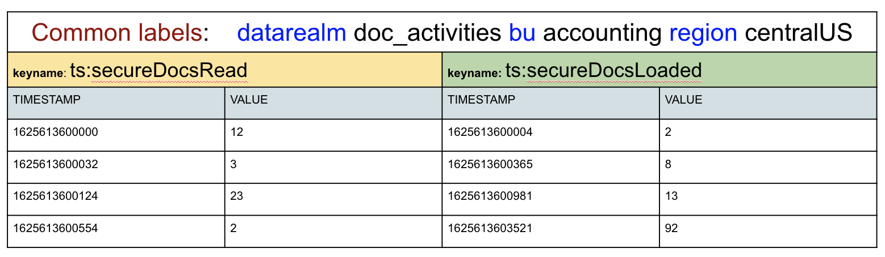
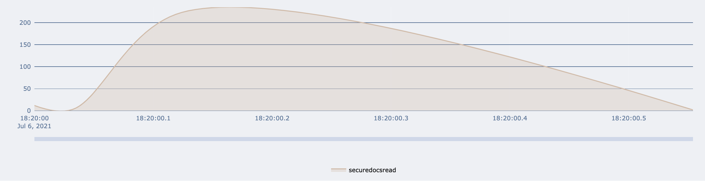
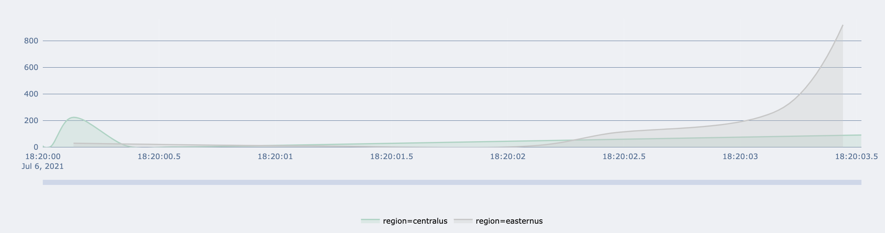

The TimeSeries API allows for many keys to be related through common labels and those labels can be simple strings.

Other than the names of the keys and the labels that create categories/classifications, the only data that can be captured is a numeric value and the timestamp as to when that value has meaning/was captured.

You end up with categories of columns of time-sorted data where each key name acts as the column name.
The example data below shows two keys that share several common labels - allowing them to be queried together

```
TS.CREATE securedocsread retention 0 LABELS datarealm doc_activities bu accounting region centralus
TS.CREATE securedocsloaded retention 0 LABELS datarealm doc_activities bu accounting region centralus

TS.ADD securedocsread 1625613600000 12
TS.ADD securedocsloaded 1625613600004 2
TS.ADD securedocsread 1625613600032 3
TS.ADD securedocsread 1625613600124 223
TS.ADD securedocsloaded 1625613600365 8
TS.ADD securedocsread 1625613600554 2
TS.ADD securedocsloaded 1625613600981 13
TS.ADD securedocsloaded 1625613603521 92
```



This allows you to query the individual keys using TS.RANGE:
```
TS.RANGE securedocsread - +
```


You can use TS.MRANGE to query across multiple keys.

You can imagine creating other keys with different values for region and then getting results like this:
```
TS.MRANGE - + FILTER datarealm=doc_activities bu=accounting GROUPBY region REDUCE SUM
```



Searching is done by key, labels, and time ranges, and the results will only be the timestamps and numeric values stored within the specified range.

The following returns the last sample / data point from any keys with a matching assigned label:

```
TS.MGET WITHLABELS FILTER region=centralus
1) 1) "securedocsloaded"
2) 1) 1) "datarealm"
2) "doc_activities"
2) 1) "bu"
2) "accounting"
3) 1) "region"
2) "centralus"
3) 1) "1625613603521"
2) "92"
2) 1) "securedocsread"
2) 1) 1) "datarealm"
2) "doc_activities"
```